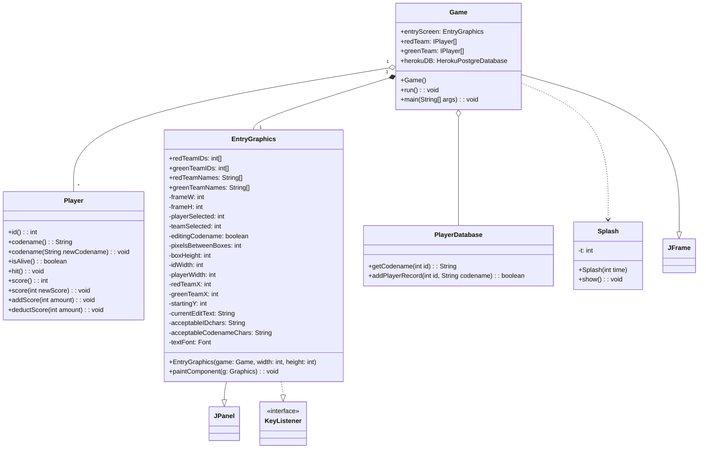

```mermaid
classDiagram-v2
    Game "1" o-- "*" Player
    Game "1" *-- "1" EntryGraphics
    Game o-- PlayerDatabase
    Game ..> Splash
    Game --|> JFrame
    EntryGraphics --|> JPanel
    EntryGraphics ..|> KeyListener

    <<interface>> KeyListener

    class Game {
        +entryScreen: EntryGraphics
        +redTeam: IPlayer[]
        +greenTeam: IPlayer[]
        +herokuDB: HerokuPostgreDatabase
        +Game()
        +run(): void
        +main(String[] args): void
    }

    class Player {
        +id(): int
        +codename(): String
        +codename(String newCodename): void
        +isAlive(): boolean
        +hit(): void
        +score(): int
        +score(int newScore): void
        +addScore(int amount): void
        +deductScore(int amount): void
    }

    class PlayerDatabase {
        +getCodename(int id): String
        +addPlayerRecord(int id, String codename): boolean
    }

    class Splash {
        -t: int
        +Splash(int time)
        +show(): void
    }

    class EntryGraphics {
        +redTeamIDs: int[]
        +greenTeamIDs: int[]
        +redTeamNames: String[]
        +greenTeamNames: String[]
        -frameW: int
        -frameH: int
        -playerSelected: int
        -teamSelected: int
        -editingCodename: boolean
        -pixelsBetweenBoxes: int
        -boxHeight: int
        -idWidth: int
        -playerWidth: int
        -redTeamX: int
        -greenTeamX: int
        -startingY: int
        -currentEditText: String
        -acceptableIDchars: String
        -acceptableCodenameChars: String
        -textFont: Font
        +EntryGraphics(game: Game, width: int, height: int)
        +paintComponent(g: Graphics): void
    }
```
