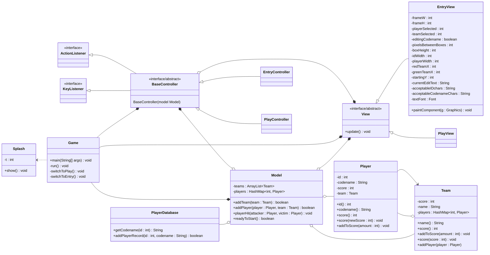

# Class Diagram

Below is a mermaid-js generated UML class diagram overview of the project in a proposed future state.

```mermaid
classDiagram-v2
    direction LR
    BaseController o--* View
    BaseController *--o Model
    Game --* View
    Model o--* View
    Game --* Model
    PlayerDatabase --o Model
    Model o-- Player
    Team o-- Player
    Team --o Model
    Player --> Team
    View <|-- EntryView
    View <|-- PlayView
    Splash <.. Game
    ActionListener <|-- BaseController
    KeyListener <|-- BaseController
    Game --* BaseController

    <<interface>> ActionListener
    <<interface>> KeyListener

    class Splash {
        -t : int
        +show() void
    }

    class Player {
        -id : int
        -codename : String
        -score : int
        -team : Team
        +id() int
        +codename() String
        +score() int
        +score(newScore : int) void
        +addToScore(amount : int) void
    }

    class Team {
        -score : int
        -name : String
        -players : HashMap~int, Player~
        +name() String
        +score() int
        +addToScore(amount : int) void
        +score(score : int) void
        +addPlayer(player : Player)
    }

    class Model {
        -teams : ArrayList~Team~
        -players : HashMap~int, Player~
        +addTeam(team : Team) boolean
        +addPlayer(player : Player, team : Team) boolean
        +playerHit(attacker : Player, victim : Player) void
        +readyToStart() boolean
    }

    class View {
        <<interface/abstract>>
        +update() void
    }

    class BaseController {
        <<interface/abstract>>
        BaseController(model Model)
    }

    class EntryController {
    }
    BaseController <|-- EntryController

    class PlayController {
    }
    BaseController <|-- PlayController

    class Game {
        +main(String[] args) void
        -run() void
        -switchToPlay() void
        -switchToEntry() void
    }

    class PlayerDatabase {
        +getCodename(id : int) String
        +addPlayerRecord(id : int, codename : String) boolean
    }

    class EntryView {
        -frameW : int
        -frameH : int
        -playerSelected : int
        -teamSelected : int
        -editingCodename : boolean
        -pixelsBetweenBoxes : int
        -boxHeight : int
        -idWidth : int
        -playerWidth : int
        -redTeamX : int
        -greenTeamX : int
        -startingY : int
        -currentEditText : String
        -acceptableIDchars : String
        -acceptableCodenameChars : String
        -textFont : Font
        +paintComponent(g : Graphics) void
    }
```
