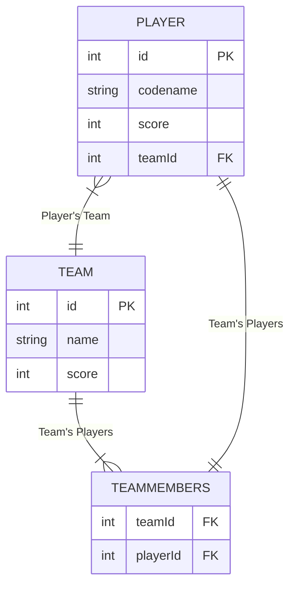

# Data Relationship Model

Diagram of the relationship between players and teams, as if in a relational database.

## Player

The basic player class, containing their ID, codename, score, and a teamId that they belong to.

- id and codename are set in the constructor
- score initialized to 0
- team will be a reference to a Team object, in place of an ID

## Team

Basic team class, containing the team name and team score.

- id is unneccesary, as we can have team contain a "TEAMMEMBERS" like table only for it's own players since it's only relevant when looking at players through the lens of a team.
- name will be set in constructor
- score initialized to 0

## TeamMembers

May not need a full class, but we need some kind of container holding references to Players for the Team. Here these references will take the place of playerIds, and since it belongs to a team, there is no need to hold a full table of all players and team combinations.

- ArrayList? Set? HashSet?
